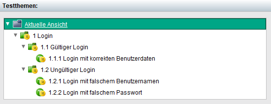
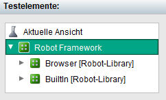
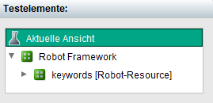
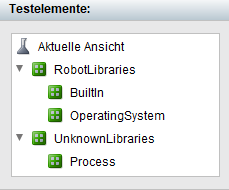
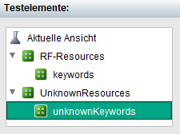

# Installation des Robot Code Generators

Voraussetzung für die Installation der Software ist eine vorhandene Python Installation. Die minimal benötigte Version ist Python 3.8. Zum Überprüfen, ob die korrekte Python Version installiert ist, kann der folgende Kommandozeilen Befehl verwendet werden:

```powershell
python --version
```

Die Installation des Code Generators erfolgt aus dem Python Package Index.
```powershell
pip install testbench2robotframework
```

Wenn die Installation durchgeführt wurde, liefert folgender Befehl die aktuell installierte Version:

```powershell
tb2robot --version
```

# Verwendung des Robot Code Generators
Nach erfolgreicher Installation des Robot Code Generators kann dieser durch den Befehl ``tb2robot`` oder ``testbench2robotframework`` ausgeführt werden.

Der Befehl ``tb2robot --help
`` zeigt, wie aus einem TestBench JSON Report, Robot Framework Testsuites generiert werden können und wie die Durchführungsergebnisse wieder eingelesen werden können.

Zum Generieren von Robot Framework Testsuites wird der Subcommand ``write`` mit  zwei Parametern aufgerufen:

- Dem Pfad zu einer JSON Datei, die als Konfigurationsdatei für die Ausgabe des Generators dient. Wird diese beim Aufruf des Code Generators nicht übergeben, so wird automatisch eine Konfigurationsdatei mit dem Namen ``config.json`` generiert.

- Dem Pfad zu den TestBech JSON Report Dateien. Diese können in einem Verzeichnis oder in einer ZIP Datei liegen.

Der folgende Aufruf demonstriert die Verwendung anhand eines Beispiels:
```powershell
tb2robot write -c .\Konfigurationsdatei.json E:\TestBench\report.zip
```
Das folgende Beispiel zeigt, wie auf diese Weise der Testthemenbaum der TestBench in Robot Framework Testsuites konvertiert wird.




Beispiel für die Generierung von Robot Framework Testsuites aus dem Testthemenbaum der TestBench. Für jedes Testthema wird ein Verzeichnis erstellt. Dieses Verzeichnis enthält eine ``__init__.robot`` Datei mit Informationen über das Testthema. Außerdem wird für jeden Testfallsatz eine Robot Framework Testsuite erzeugt, die die eigentlichen Testfälle enthält.

Nach Ausführung der Robotframework Test Suites können die Ergebnisse zurück in den Json Report der Tesbench geschrieben werden.
Zu diesem Zweck wird der Subcommand ``read`` verwendet, der eine XML-Ergebnisdatei liest und die Ergebnisse in die JSON-Dateien schreibt.

- Den Pfad zu einer Robot Framework XML-Ergebnisdatei, aus der die Ergebnisse der Testdurchführung gelesen werden.

- Den Pfad zu einem Verzeichnis oder einer ZIP Datei in der die Ergebnisse gespeichert werden sollen. Dies ist ein optionaler Parameter. Wird der Parameter nicht übergeben, so wird der übergebene JSON Report überschrieben.

- Den Pfad zu den TestBech JSON Report Dateien (ohne Ergebnisse). Diese können in einem Verzeichnis oder in einer ZIP Datei liegen.

Der folgende Aufruf demonstriert das Lesen der Ergebnisse anhand eines Beispiels:
```powershell
tb2robot read -o .\output.xml -r .\ReportWithResults.zip E:\TestBench\report.zip
```

# Konfiguration der Ergebnisse
Zur Konfiguration des Ergebnisses sollte beim Aufruf des Robot Code Generators der Pfad zu einer JSON Konfigurationsdatei übergeben werden. Auf diese Weise kann beispielsweise der Pfad angegeben werden, in welchem die *.robot Dateien erzeugt werden. Die Konfigurationsdatei kann die folgenden Einstellungen enthalten:

## rfLibraryRegex
Eine Liste von regulären Ausdrücken, mittels derer TestBench Subdivisionen als Robot Framework Bibliotheken identifiziert werden können.
Der standardmäßig eingestellte Regex findet alle Subdivisionen, deren Name auf "[Robot-Library]" enden. Wenn eine Interaktion aus einer der gefundenen Subdivisionen verwendet wird, so wird diese Subdivision in der generierten Robot Framework Testsuite als Bibliothek importiert.
Auf diese Weise führt beispielsweise die Verwendung von Interaktionen aus den folgenden TestBench Subdivisionen zum Import der ``Browser-`` und ``BuiltIn`` Bibliotheken.



```python
*** Settings ***
Library    Browser
Library    BuiltIn
```
In der Konfigurationsdatei kann der reguläre Ausdruck abgeändert werden. Der Name, mit dem die Bibliothek, in der Robot Framework Testsuite eingebunden werden soll, muss dabei über die named group ``?P<resourceName>`` angegeben werden.
```json
"rfLibraryRegex": [
    "(?:.*\\.)?(?P<resourceName>[^.]+?)\\s*\\[Robot-Library\\].*"
  ]
```

## rfResourceRegex
Analog zum ``rfLibraryRegex`` gibt es auch einen regulären Ausdruck, der für das Identifizieren von Subdivisionen zuständig ist, die als Robot Framework Ressourcen importiert werden sollen.
Standardmäßig werden über diesen Regex alle Subdivisionen, deren Namen auf "[Robot-Resource]" enden, als Ressourcen in den Robot Framework Testsuiten importiert.
Im folgenden Beispiel wird die Robot Framework Ressource mit dem Namen ``keywords.resource`` importiert, da die zugehörige Subdivision mit ``[Robot-Resource]`` endet.



```python
*** Settings ***
Resource    keywords.resource
```
In der Konfigurationsdatei kann der reguläre Ausdruck abgeändert werden. Der Name, mit dem die Ressource in der Robot Framework Testsuite eingebunden werden soll, muss dabei über die named group ``?P<resourceName>`` angegeben werden.
```json
"rfResourceRegex": [
    "(?:.*\\.)?(?P<resourceName>[^.]+?)\\s*\\[Robot-Resource\\].*"
  ]
```
## rfLibraryRoots
Eine Liste der verschiedenen TestBench Root Subdivisionen, die Robotframework Bibliotheken enthalten.
Das Verwenden einer Interaktion aus einer ``rfLibraryRoots`` Subdivision, führt dazu, dass die Subdivision der zweiten Ebene, unter welcher die verwendete Interaktion (in einer beliebiger Tiefe) zu finden ist, als Library in der Robot Framework Test Suite importiert wird.

Bibliotheken (Subdivisionen der zweiten Ebene des Testelementebaumes), die nicht in einer der Root Subdivision enthalten sind, werden als ``Unknown`` Import in der Robotdatei markiert.

Im folgenden Beispiel ist lediglich die ``RobotLibraries`` Subdivision als ``rfLibraryRoot`` vorgegeben.

```json
"rfLibraryRoots": ["RobotLibraries"]
```



Dies führt dazu, dass nur die in dieser Subdivision enthaltenden Bibliotheken ``BuiltIn`` und ``OperatingSystem`` importiert werden. Die ``Process`` Bibliothek ist hingegen in einer Subdivision definiert, die nicht als ``rfLibraryRoot`` angegeben ist. Aus diesem Grund wird sie nicht importiert:

```python
*** Settings ***
Library    BuiltIn
Library    OperatingSystem
# UNKNOWN    Process
```

## rfResourceRoots
Analog zu den Bibliotheken müssen auch die Root Subdivision der Robot Framework Ressourcen Dateien in der Konfigurationsdatei angegeben werden.

Das folgende Beispiel zeigt, den Import von Subdivisionen, die nicht als ``rfResourceRoots`` angegeben sind:

```json
"rfResourceRoots": ["RF-Resources"]
```



Da ``UnknownResources`` nicht in den ``rfResourceRoots`` enthalten ist, wird die in dieser Subdivision enthaltende Ressourcedatei ``unknownKeywords`` nicht importiert.

```python
*** Settings ***
Resource    keywords.resource
# UNKNOWN    unknownKeywords
```

## fullyQualified
Boolesche Variable, die angibt, ob die Keywords in den generierten Robot Dateien lediglich durch den Keywordnamen aufgerufen werden oder, ob zusätzlich der Bibliotheksname vorangestellt werden soll.

Die Konfiguration ``"fullyQualified": true`` führt beispielsweise zu dem folgenden Keyword Aufruf:

```python
SeleniumLibrary.Open Browser      https://robotframework.org/    firefox
```
Wird hingegen ``"fullyQualified": false`` verwendet, so wird das Keyword ohne den zugehörigen Bibliotheksnamen aufgerufen:

```python
Open Browser      https://robotframework.org/    firefox
```

## resourceDirectory
Damit der Robot Code Generator die korrekten Ressourcen in der Setting Section der Testsuites einbindet, muss in der Konfigurationsdatei der Pfad zu einem Verzeichnis angegeben werden, das sämtliche für das Projekt benötigten Ressourcen Dateien enthält. Dieser Pfad kann absolut oder relativ zu dem Verzeichnis, in dem der Robot Code Generator ausgeführt wurde, angegeben werden.
Im Falle eines relativen Pfades muss ein ``{root}`` vorangestellt werden.

```json
"resourceDirectory": "{root}/Resources",
```

```robotframework
*** Settings ***
Resource    ../Resources/myKeywords.resource
```

## generationDirectory
Der Pfad zu dem Verzeichnis mit den generierten Robot Framework Testsuites kann über den Parameter ``generationDirectory`` vorgegeben werden. Wie bereits beim ``resourceDirectory`` kann auch dieser Pfad relativ oder absolut angegeben werden:
```json
"generationDirectory": "{root}/generatedRobotFiles"
```

## createOutputZip
Für den Fall, dass die Ausgabe des Robot Code Generators auch in Form einer ZIP Datei erfolgen soll, muss die Variable createOutputZip auf true gesetzt werden. Dies hat zur Folge, dass sowohl ein Verzeichnis als auch eine ZIP Datei mit den generierten Robotframework Testsuites erstellt wird.

## logSuiteNumbering
Über die Boolesche Variable ``logSuiteNumbering`` kann angegeben werden, ob der Präfix eines Verzeichnisses in den Logs angezeigt werden soll. Der Präfix eines Verzeichnisses/einer Robot Framework Testsuite bestimmt die Reihenfolge, in der die Test Suites ausgeführt werden.

```json
"logSuiteNumbering": true
```
## clearGenerationDirectory
Wird  die Variable ``clearGenerationDirectory`` auf ``true`` gesetzt, so werden bei jeder Ausführung des Robot Code Generators die Dateien der vorherigen Läufe gelöscht.

```json
"clearGenerationDirectory": true,
```

## logCompoundInteractions
Bei der Konvertierung der TestBench Testfallsätze nach Robotframework werden lediglich die atomaren Interaktionen in Robotframework aufgerufen. Damit ein Benutzer die gesamte Hierarchie eines Testfallsatzes in Robotframework sehen kann, muss der Wert der Variablen ``logCompoundInteractions`` ``true`` sein. Dies hat zur Folge, dass auch die zusammengesetzten Interaktionen als Kommentare in den Testsuites erscheinen. Durch eine entsprechende Einrückung kann ein Benutzer erkennen, in welcher zusammengesetzten Interaktion eine atomare Interaktion aufgerufen wird.

```json
"logCompoundInteractions": true,
```

## subdivisionsMapping
Im ``subdivisionsMapping`` kann definiert werden, welche TestBench Subdivision welchem Import Statement in Robotframework entspricht. Auf diese Weise können auch Bibliotheken mit bestimmten Parametern und "Remote Libraries" eingebunden werden. Bibliotheken und Ressourcen, die an dieser Stelle definiert werden, werden nur importiert, wenn auch ein Keyword der entsprechenden Bibliothek/Ressource verwendet wird.

```json
"subdivisionsMapping": {
    "libraries": {
      "SeleniumLibrary": "SeleniumLibrary    timeout=10    implicit_wait=1    run_on_failure=Capture Page Screenshot",
      "SuperRemoteLibrary": "Remote    http://127.0.0.1:8270       WITH NAME    SuperRemoteLibrary"
    },
    "resources": {
      "MyKeywords": "{root}/../MyKeywords.resource",
      "MyOtherKeywords": "{resourceDirectory}/subdir/MyOtherKeywords.resource"
    }
  }
```


## forcedImport
Damit eine Bibliotheks-, Ressourcen- oder eine Variablendatei importiert wird, ohne dass es eine entsprechende Subdivision in der TestBench gibt, muss diese als ``forcedImport`` hinterlegt sein. Dateien, die auf diese Weise importiert werden, werden in jeder Testsuite importiert, unabhängig davon, ob ein Keyword aus dieser Datei verwendet wird.

```json
"forcedImport": {
    "libraries": [
      "SeleniumLibrary"
    ],
    "resources":
    [
      "technical_keywords.resource"
    ],
    "variables": [
      "myVars.py"
    ]
  }
```

## loggingConfiguration
Über die Einstellung ``loggingConfiguration`` kann das Log-Level gesetzt werden.
Gültige Optionen sind:

* "CRITICAL"

* "FATAL"

* "ERROR"

* "WARNING"

* "WARN"

* "INFO"

* "DEBUG"

* "NOTSET"

Das Default Log-Level ist ``INFO``.
```json
"loggingConfiguration": {
  "console": {
    "logLevel": "info"
  }
}
```

## referenceBehaviour
Damit die Referenzen, die während der Testdurchführung erstellt werden, in die TestBench importiert werden können, muss die ``referenceBehaviour`` angegeben werden.
Diese definiert, ob eine Referenz als Anhang oder als Referenz auf eine im Dateisystem liegende Datei importiert werden soll.
Der Parameter kann somit einen der beiden Werte ``REFERENCE`` oder ``ATTACHMENT`` annehmen.

```json
"referenceBehaviour": "ATTACHMENT"
```

## attachmentConflictBehaviour
Für den Fall, dass eine Referenz als Attachment importiert werden soll, muss angegeben werden, wie gleiche Dateinamen zu behandeln sind.
Zu diesem Zweck kann der Parameter attachmentConflictBehaviour mit einem der Werte ``ERROR``, ``USE_NEW``, ``USE_EXISTING`` oder ``RENAME_NEW`` angegeben werden.

Die möglichen Werte haben dabei die folgende Bedeutung:
- ERROR: Für den Fall, dass mehrere Attachments mit dem gleichen Namen existieren, wird eine Fehlermeldung geworfen. Es wird lediglich das zuerst gelesene Attachment importiert.
- USE_EXISTING: Für den Fall, dass mehrere Attachments mit dem gleichen Namen existieren, wird lediglich das zuerst gelesene Attachment importiert.
- USE_NEW: Für den Fall, dass mehrere Attachments mit dem gleichen Namen existieren, wird lediglich das zuletzt gelesene Attachment importiert.
- RENAME_NEW: Für den Fall, dass ein Attachment gelesen wird und bereits ein gleichnamiges existiert, wird der Name des neuen Attachments abgewandelt, dass er einzigartig ist und importiert werden kann.
```json
"attachmentConflictBehaviour": "USE_EXISTING"
```

## testCaseSplitPathRegEx
Über den im Parameter ``testCaseSplitPathRegEx`` angegebenen Wert kann ein Benutzer bestimmen, ob ein Testfallsatz aus der TestBench in mehrere Robot Framework Testfälle unterteilt werden soll. Zu diesem Zweck muss der Benutzer in ``testCaseSplitPathRegEx`` den Namen einer Interaktion definieren, anhand welcher der Code Generator erkennt, dass ein Testfall an dieser Stelle unterteilt werden soll. Anschließend kann diese ``Splitting interaction`` in einem Testfallsatz zum Unterteilen von Testfällen verwendet werden.

