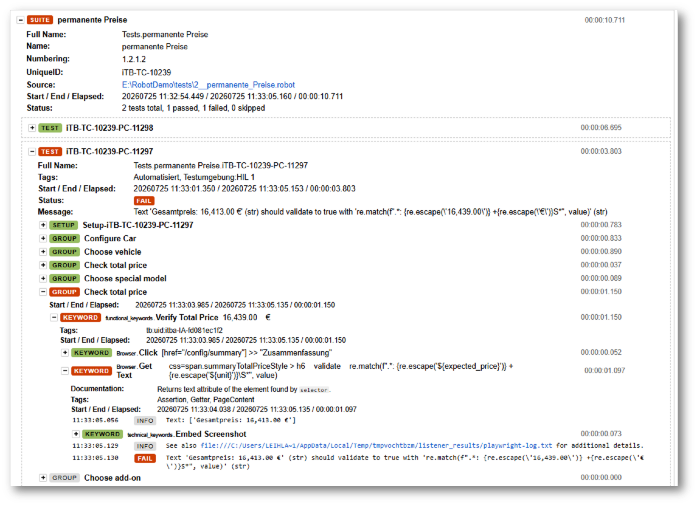
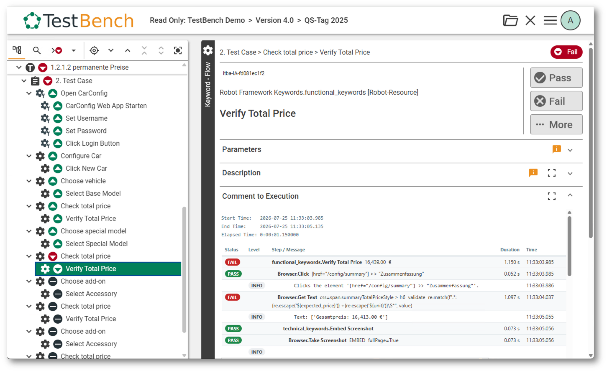
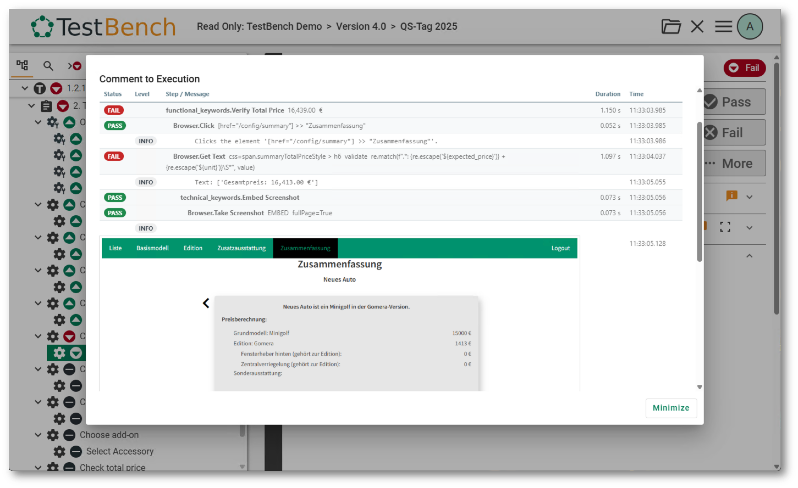
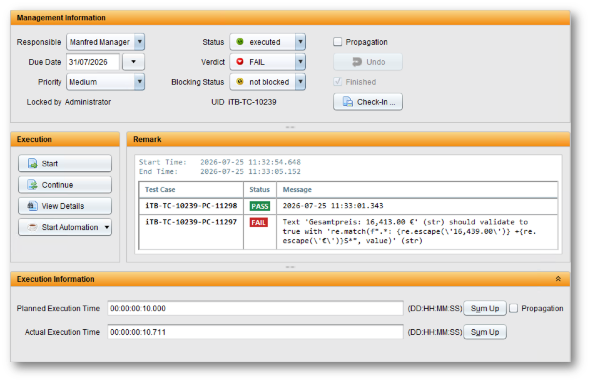

# Fetching Results

`fetch-results` writes the results of a Robot Framework run back into the
TestBench report the suites were generated from.

## How it works

```
   ┌────────────────────────┐        ┌────────────────────────────┐
   │  TestBench JSON        │        │  Robot Framework           │
   │  report (in)           │   +    │  output.xml                │
   │  (directory or .zip)   │        │  (the executed results)    │
   └───────────┬────────────┘        └─────────────┬──────────────┘
               └────────────────┬──────────────────┘   ┌────────────────────────┐
                                │                      │  Configuration         │
                                ▼                      │  / TOML / CLI options  │
                     ┌─────────────────────┐           └─────────────┬──────────┘
                     │   fetch-results     │─────────────────────────┘
                     └──────────┬──────────┘
                                ▼
                ┌───────────────────────────────┐
                │  TestBench JSON report (out)  │
                │  with results:                │
                │    verdicts + execution       │
                │    comments, protocol.json,   │
                │    references, attachments    │
                └───────────────────────────────┘
```


- **In:** the original TestBench report (the same directory or ZIP file the suites
  were generated from) **and** the Robot Framework `output.xml` of the run.
- **Out:** an updated TestBench JSON report you can import back into TestBench.
  With `-d` it is written to a new location and the input report stays untouched;
  **without `-d` the input report is overwritten**. All six input/output
  combinations are listed under
  [`output-directory` with `fetch-results`](../configuration/overview.md#output-directory-with-fetch-results).

<br />
**Img-1:** Robot Framework `log.html` of a test run

This Robot Framework execution result is written back into the TestBench report
and can be imported back into TestBench and viewed in details in the Web iTORX.

<br />
**Img-2:** Test Case Set Execution in iTORX

<br />
**Img-3:** Keyword Execution Log in iTORX (with failed keyword)

The level of detail in the execution comment is controlled by the `keyword-comment-*` options —
[`keyword-comment-style`](../configuration/overview.md#keyword-comment-style),
[`keyword-comment-max-depth`](../configuration/overview.md#keyword-comment-max-depth),
[`keyword-comment-max-rows`](../configuration/overview.md#keyword-comment-max-rows)
and
[`keyword-comment-log-level`](../configuration/overview.md#keyword-comment-log-level).
If you do not need the whole technical details, you can reduce the depth and number of rows to keep the comment compact.

In TestBench, the execution is shown also on test case set level with execution time,
error message and verdict.

<br />
**Img-4:** Execution Comment in TestBench (with failed test case)

Robot suites and tests are matched to TestBench elements by the `UniqueID`
metadata that `generate-tests` wrote into every suite — so **both files must come
from the same generation**.

```bash
testbench2robotframework fetch-results -d ./updated_report.zip output.xml my_report.zip
```

How the command line is structured is explained in
[Command-Line Usage](../configuration/cli_options.md); every option and its
values is described in the [Configuration Reference](../configuration/overview.md).

### What is written back

- The **verdict and status** of every keyword, test case and test case set, plus
  HTML **execution comments**.
- The verdicts in the **test structure tree** (`cycle_structure.json`), aggregated
  upwards: test case → test case set → test theme, using the TestBench verdict
  priority (`Blocked` outranks `Fail`, `Fail` outranks `Undefined`, …).
- The main **protocol** (`protocol.json`) and `references.json`.
- **Attachments** referenced from test messages.

---

## Merging results into the protocol

By default the results are **merged** into the `protocol.json` already contained
in the report instead of overwriting it:

- Executions the Robot run covers are replaced by the new result.
- Executions the run does not cover are kept unchanged.
- The verdict of a test case set (and its parent themes) is recomputed over **all**
  its test cases — the preserved ones and the newly executed ones. A set whose
  preserved test case failed therefore stays `Fail`, even when every test of the
  current run passed.

This lets you execute and report a cycle in several partial runs. Turn it off with
[`merge-protocol` / `--no-merge-protocol`](../configuration/overview.md#merge-protocol)
to write only the current run's results.

:::caution
Merging always starts from the protocol in the **input report**. Running
`fetch-results` twice with the same input report does not accumulate results — the
second run starts over. To combine several Robot runs, merge the output XMLs first
(`rebot --merge output1.xml output2.xml`) and call `fetch-results` once.
:::

---

## Execution comments

The execution comment of a keyword shows the **structure** of the Robot Framework
user keyword behind it — its sub keywords, control structures and loop iterations,
each with its own log messages in the order Robot recorded them. A keyword not
executed because an earlier one failed shows as `NOT RUN`. Test case and test case
set comments lead with a status pill and a compact summary.

The comment is deliberately plain HTML (one flat table, no nested tables, no CSS
classes) so it survives a PDF export, a paste into Word, and the WYSIWYG editor of
the TestBench client.

How much of that structure is shown, and which log levels, is controlled by the
`keyword-comment-*` options —
[`keyword-comment-style`](../configuration/overview.md#keyword-comment-style),
[`keyword-comment-max-depth`](../configuration/overview.md#keyword-comment-max-depth),
[`keyword-comment-max-rows`](../configuration/overview.md#keyword-comment-max-rows)
and
[`keyword-comment-log-level`](../configuration/overview.md#keyword-comment-log-level).

---

## References and attachments

Files referenced from a test message via an `itb-reference:` marker are written
into the report. Whether such a file is attached, stored as a reference, or ignored
is controlled by
[`reference-behaviour`](../configuration/overview.md#reference-behaviour);
[`attachment-conflict-behaviour`](../configuration/overview.md#attachment-conflict-behaviour)
decides what happens when an attachment of the same name already exists. Files
larger than 10 MB are skipped with an error message.

### The `itb-reference:` marker

A marker is the word `itb-reference:` followed by one value without whitespace.
The marker is removed from the message before it becomes the execution comment;
a message may carry several markers.

```robotframework
Set Test Message    Screenshot taken.\n\nitb-reference: screenshot.png    append=True
```

The value is resolved like a URI reference:

| Value | Meaning |
|---|---|
| `screenshot.png`, `results/run.zip` | **Relative** to the directory of the `output.xml` — the Robot output directory. |
| `file:///var/log/run.zip`, `file:///C:/log/run.zip` | **Absolute** path. A `file:` URI is always absolute ([RFC 8089](https://www.rfc-editor.org/rfc/rfc8089)); `file:///run.zip` is the file `run.zip` in the file system root, *not* in the output directory. |
| `my%20file.png` | Percent-encoding is decoded. |

A relative value is the right choice for files Robot wrote into its output
directory, and the only form that resolves to the same file both here and in a
browser showing `log.html`. Use an absolute `file:` URI for files outside the
output directory. Both are looked up first as given (relative to the current
working directory), then relative to the `output.xml`.

A file that cannot be found is skipped with a warning; with
`reference-behaviour = "REFERENCE"` an absolute path is stored even if it does
not exist on the machine running `fetch-results`.

---

## The full round trip

```bash
# 1. Generate suites from the TestBench report
testbench2robotframework generate-tests -d ./Generated my_report.zip

# 2. Execute them with Robot Framework
robot --outputdir ./results ./Generated

# 3. Write the results back into a new report
testbench2robotframework fetch-results -d ./updated_report.zip ./results/output.xml my_report.zip
```

The updated report (`updated_report.zip`) can then be imported into TestBench.
