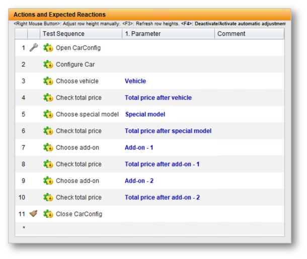
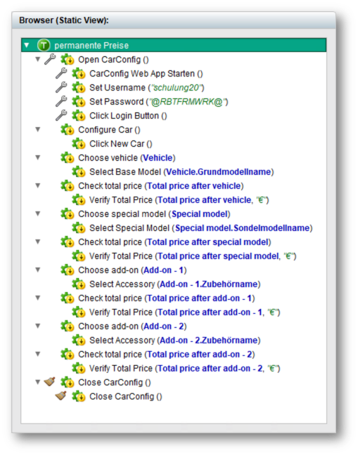
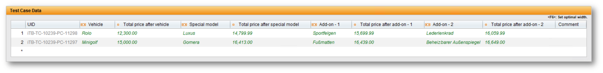
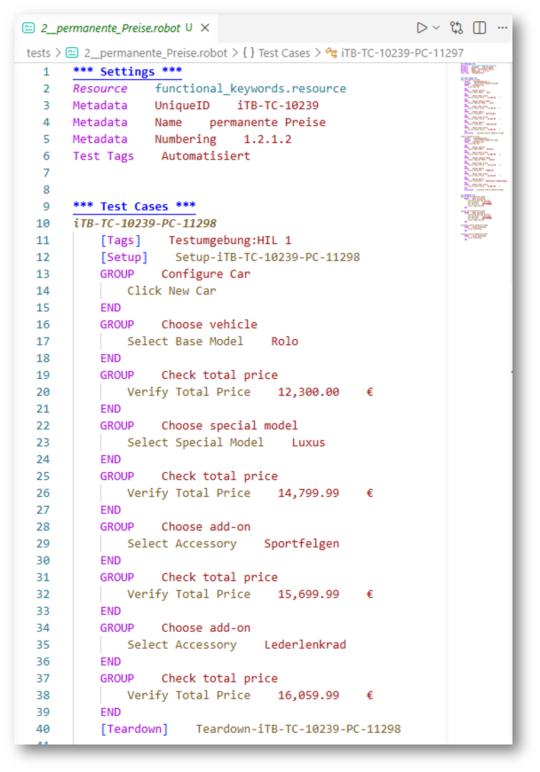
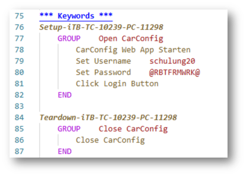
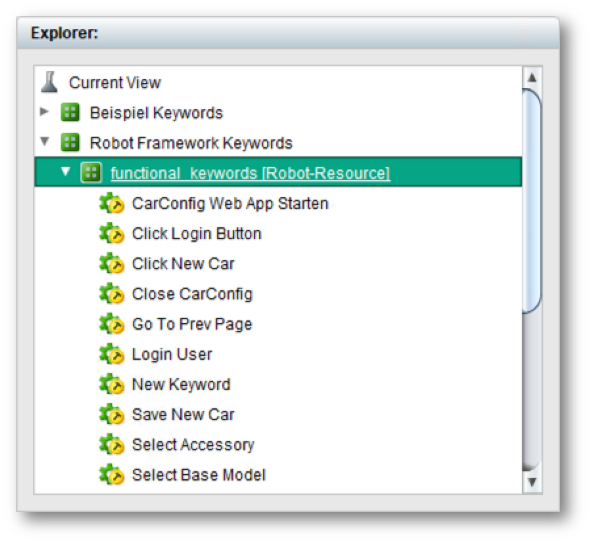
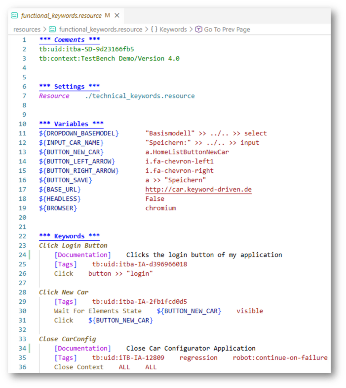

# Generating Tests

`generate-tests` turns a TestBench JSON report into a directory of runnable Robot
Framework test suites.

## How it works

```
        ┌────────────────────────┐
        │  TestBench             │
        │  JSON-full-report      │
        │  (directory or .zip)   │  ┌──────────────────────────────┐
        └───────────┬────────────┘  │  Configuration               │
                    │               │  pyproject.toml / robot.toml │
                    ▼               │  / -c file / CLI options     │
         ┌─────────────────────┐    └─────────────┬────────────────┘
         │   generate-tests    │──────────────────┘
         └──────────┬──────────┘
                    ▼
    ┌───────────────────────────────┐
    │  Robot Framework test suites  │
    │  <output-directory>/          │
    │    <Theme>/__init__.robot     │
    │    <Theme>/<Set>.robot        │
    └───────────────────────────────┘
```

- **In:** a TestBench JSON full report — a directory or ZIP file containing
  `manifest.json`, the test structure tree and one JSON file per test case set
  and test case. See [Obtaining the JSON report](../intro.md#obtaining-the-json-report).
- **Plus:** your configuration, which mainly maps TestBench keywords to Robot
  Framework libraries and resource files.
- **Out:** one `.robot` suite per test case set and an `__init__.robot` per test
  theme, mirroring the TestBench structure, written into the
  [`output-directory`](../configuration/overview.md#output-directory).

### Example TestBench Test Case Set

The following TestBench test case set has 11 high-level keywords (**Img-1**),
which are composed of low-level Robot Framework keywords (**Img-2**).
Each high-level keyword has a test case parameter, which is set in the Test Case Data table (**Img-3**).

<br />
**Img-1:** Test Case Set in TestBench

<br />
**Img-2:** Test Sequence Structure in Browser

<br />
**Img-3:** Test Case Data Table in TestBench

When this test case set is generated, the generated Robot Framework suite `Generated/2__permanente_Preise.robot` (**Img-4**) contains 2 test cases, each with a `GROUP` block that represents the high-level keywords. The low-level keywords are called inside the `GROUP` blocks.

Test Setup and Teardown keywords are generated separately per test case. (**Img-5**)

<br />
**Img-4:** Generated Robot Framework Suite

<br />
**Img-5:** Test Setup and Teardown Keywords

The report must be exported from TestBench 4.1 — the version recorded in its
`manifest.json` is checked before anything is generated.

```bash
testbench2robotframework generate-tests -d ./Generated my_report.zip
```

How the command line is structured is explained in
[Command-Line Usage](../configuration/cli_options.md); every option and its
values is described in the [Configuration Reference](../configuration/overview.md).

---

## Modeling Keywords in TestBench

This is the part that makes the generated suites actually run: the tool has to
know which Robot Framework **library** or **resource file** each TestBench keyword
belongs to. Every keyword in TestBench lives in a **subdivision**, and its
subdivision path decides the import and the name the keyword is called with.
Structure the subdivisions after one of two conventions.

### Convention 1: marker suffixes (the shipped defaults)

Name a subdivision after the Robot Framework library or resource file and append
a marker:

```
Interactions
├── Browser [Robot-Library]                  ← keywords of a Robot library
│   ├── New Browser
│   └── Click
└── functional_keywords [Robot-Resource]     ← keywords of a resource file
    └── Login User
```

<br />
**Img-6:** Test Elements in TestBench

<br />
**Img-7:** User Keywords in Robot Framework

The default patterns match the part before ` [Robot-Library]` /
` [Robot-Resource]` anywhere in the keyword's path, so nesting above or below the
marked subdivision is fine. The example generates:

```robotframework
*** Settings ***
Library     Browser
Resource    functional_keywords.resource
```

The marker texts are not fixed — they come from the
[`library-regex`](../configuration/overview.md#library-regex--resource-regex) and
[`resource-regex`](../configuration/overview.md#library-regex--resource-regex)
options; the pattern rules are in
[Subdivision Patterns](../configuration/pyproject_config.md#subdivision-patterns).

### Convention 2: root subdivisions

Alternatively, collect libraries and resources under fixed root subdivisions. The
**direct children** of a root are the import names:

```
RF                           ← library root (defaults: "RF", "RF-Library")
├── Browser                  → Library    Browser
└── RoboSAPiens              → Library    RoboSAPiens
RF-Resource                  ← resource root (default: "RF-Resource")
└── functional_keywords      → Resource   functional_keywords.resource
```

The roots are set via
[`library-root`](../configuration/overview.md#library-root--resource-root) and
[`resource-root`](../configuration/overview.md#library-root--resource-root).

### How a keyword is resolved

For each keyword the subdivision path is checked in this order — the first match
wins:

1. a `library-regex` pattern → **Library** import, name from the pattern
2. a `resource-regex` pattern → **Resource** import
3. first path segment in a library root → **Library**, second segment is the name
4. first path segment in a resource root → **Resource**, second segment is the name
5. otherwise the subdivision is **unknown**: a warning is logged and a
   `# UNKNOWN    <path>` comment is written into the suite instead of an import.
   The suite is still generated, but that keyword fails until you configure a
   mapping.

When a matched name needs a different import statement — library arguments, a
remote library, an unusual path — override it per name with
[`library-mapping` / `resource-mapping`](../configuration/overview.md#library-mapping--resource-mapping),
for example:

```toml
[tool.testbench2robotframework.library-mapping]
RoboSAPiens = "RoboSAPiens    language=de"

[tool.testbench2robotframework.resource-mapping]
functional_keywords = "{root}/shared/functional_keywords.resource"
```

### Keyword names

The **keyword names** in TestBench must equal the Robot Framework keyword names
(matching is case- and space-insensitive on the Robot side). If two imports offer
a keyword of the same name, enable
[`fully-qualified`](../configuration/overview.md#fully-qualified) so the generated
calls use the library-qualified name (e.g. `Browser.Click`).

### Where resource files live

Resource imports point into
[`resource-directory`](../configuration/overview.md#resource-directory), which is
empty by default — a resource is then imported by plain file name and resolved by
Robot Framework relative to each generated suite.

:::important
It is a clear recommendation to set the Python search path (`PYTHONPATH`) to
include the directory containing the resource files, so that Robot Framework finds
them at runtime.

Robot Framework resolves a **relative** resource path either relative to the
Python search path (`PYTHONPATH`) or relative to the `.robot` file that imports it.
If the Python path is not set, the resource file is therefore expected right next
to each generated suite, e.g. `Generated/1__Theme/functional_keywords.resource`.

In case the Python search path can not be used, you can work with absolute paths
in the generated suites. For one fixed location set an absolute `resource-directory`
such as `"{root}/Resources"` (as in the shipped example configuration); `{root}` is
replaced by the absolute path of the directory `generate-tests` runs in, so the
generated suites contain absolute paths.
:::

A subdivision matching
[`resource-directory-regex`](../configuration/overview.md#resource-directory-regex)
(default marker `[Robot-Resources]`) marks a resource root; subdivisions between it
and the resource become subdirectories:

```
Root [Robot-Resources]
└── Sub
    └── Common [Robot-Resource]   → <resource-directory>/Sub/Common.resource
```

---

## What else you can control

Beyond keyword mapping, `generate-tests` offers a few functional switches. Each
links to its full description in the Configuration Reference.

### Skip blocked test elements

Test elements whose TestBench execution status is `Blocked` are **not** generated
by default — a blocked test case is left out of its suite, a blocked test case set
produces no `.robot` file, and a blocked test theme drops its whole subtree, so a
CI pipeline does not execute tests the tester marked as not executable. The number
of skipped elements is logged:

```
INFO: Skipped 1 blocked test case sets and 3 blocked test cases. Use '--include-blocked' to generate them anyway.
```

Generate them anyway with
[`include-blocked`](../configuration/overview.md#include-blocked).

:::info
Blocking is part of a test cycle's execution data. A specification export
(`tov_structure.json`) has no execution status, so nothing is filtered there.
:::

### Split a test case into phases

Some keywords restart the system under test mid-test. An interaction matching
[`testcase-splitting-regex`](../configuration/overview.md#testcase-splitting-regex)
splits the TestBench test case into several Robot Framework tests at that point,
named by [`phase-pattern`](../configuration/overview.md#phase-pattern). One test
case `itb-TC-1-PC-2` with a single split point becomes the Robot tests
`itb-TC-1-PC-2 : Phase 1/2` and `itb-TC-1-PC-2 : Phase 2/2`. `fetch-results`
recombines the phases into one TestBench result using the same pattern.

:::caution
Keep `phase-pattern` identical for `generate-tests` and `fetch-results` — the
results are matched by that pattern.
:::

### Represent compound keywords

Higher-level (compound) TestBench keywords can be rendered as a Robot Framework
`GROUP` block, as comments, or inlined without a marker — see
[`compound-keyword-logging`](../configuration/overview.md#compound-keyword-logging).

### Add suite metadata

Extra `Metadata` entries — including values pulled from the test case set model
via `{$tcs...}` placeholders — can be added to every suite with
[`metadata`](../configuration/overview.md#metadata).
